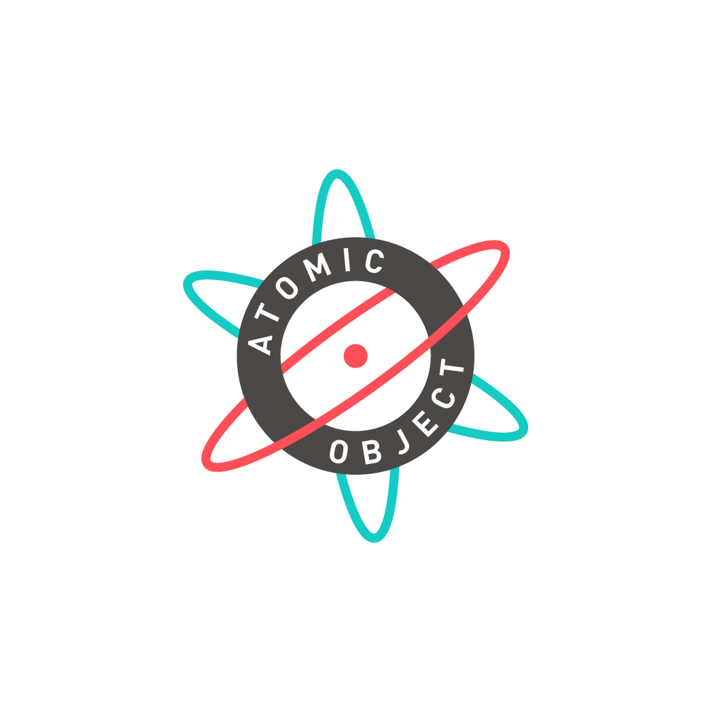
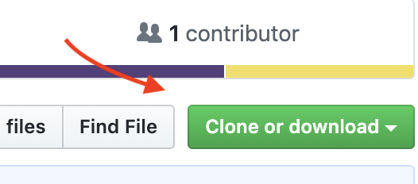

# cell-two-git-workshop

  

<h3 align="center">Git Workshop</h3>

  Welcome! Here is where you will find all you need to know about getting started and how to find exercises and tools you'll use during the workshop.

## Table of Contents
- [What You'll Need](#what-you'll-need)
- [Getting Started](#fork-and-clone-repository)
- [Resources](#resources)

## What You'll Need

* Have an IDE or text editor (Visual Studio Code, Sublime, etc.)
* Install Git
  * Windows: [Git Bash](https://gitforwindows.org/)
  * Mac: [https://git-scm.com/download/mac](https://git-scm.com/download/mac)
  * Linux: [https://git-scm.com/download/linux](https://git-scm.com/download/linux)
* Download terminal
  * Windows: use Git Bash. Included in the Git download.
  * Mac: built-in macOS Terminal, iTerm2
* Create GitHub account
* Fork and clone workshop repository *See instructions below*

## Fork and Clone Repository

1. Sign in to Fork the repo
	* Click the fork button in Github. *See the image below*

	

2. Clone the repo to you local machine
	*  Open your terminal.
	*  Navigate to where you want to add the repo.
	*  Run `git clone <repo-https>`. *See the image below for where to copy repo https*

	

## Resources

Go to the Wiki to view the [*Cheat Sheet*](https://github.com/atomicobject/cell-two-git-workshop/wiki/Cheat-Sheet) for a quick quide to the basic Git commands and [*References*](https://github.com/atomicobject/cell-two-git-workshop/wiki/References) for a more indepth explanation of terms.

All the slides from the workshop are available [here](https://github.com/atomicobject/cell-two-git-workshop/blob/master/Git%20Workshop.pdf)

## Creators
* Brian May
* Bekah Cheek
* Joe Bustamante
* Meredith Lind

### Check out the Accelerator Program
Interested in learning more about Atomic object? [Read more about it](https://atomicobject.com/careers/accelerator)
