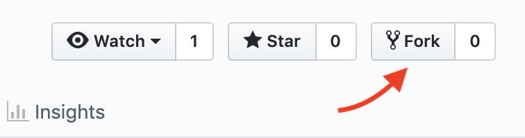

# cell-two-git-workshop

  

<h3 align="center">Git Workshop</h3>

  Welcome! Here is where you will find all you need to know about getting started and how to find exercises and tools you'll use during the workshop.

## Table of Contents

- [Getting Started](#getting-started)
- [Resources](#resources)

## Getting Started

1. Fork the repo - click the fork button in Github. *See the image below*

	

2. Clone the repo to you local machine - `git clone https://github.com/atomicobject/cell-two-git-workshop.git`

## Resources

Go to the Wiki to view the [*Cheet Sheet*](https://github.com/atomicobject/cell-two-git-workshop/wiki/Cheat-Sheet) for a quick quide to the basic Git commands and [*References*](https://github.com/atomicobject/cell-two-git-workshop/wiki/References) for a more indepth explanation of terms.

## Creators
* Brian May
* Bekah Cheek
* Joe Bustamante
* Meredith Lind
